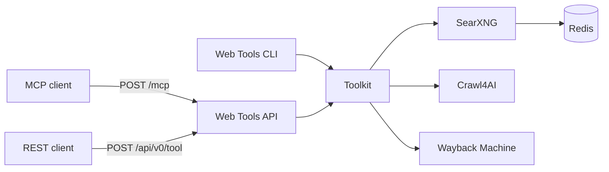
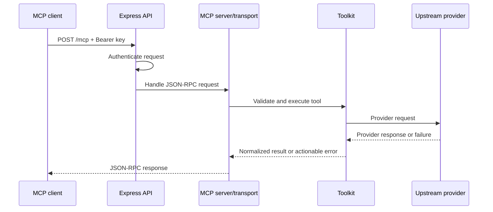
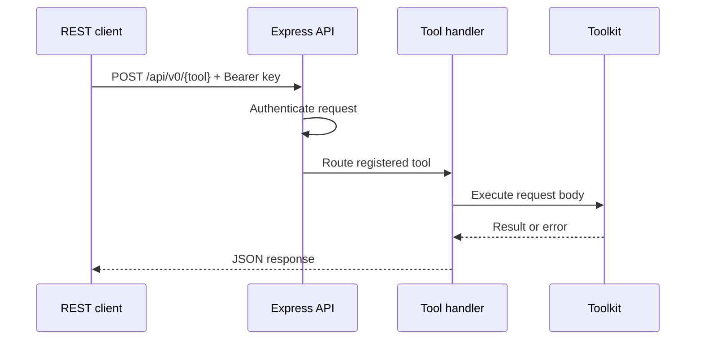
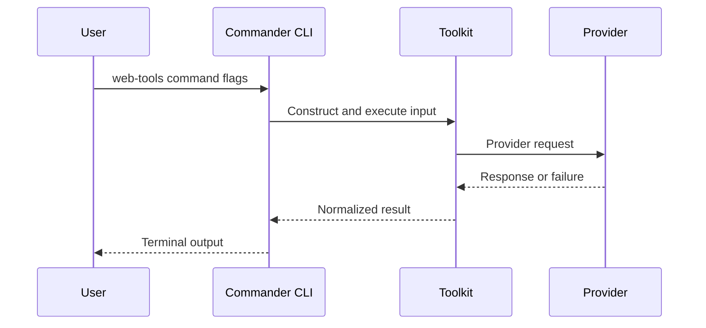

# Web Tools Architecture

## Overview

Web Tools is a pnpm TypeScript monorepo backed by three external runtime dependencies. Its core design rule is that tool behavior belongs to the framework-agnostic toolkit, while MCP, REST, and CLI are adapters over that behavior.



The deployed stack has four owned services: Web Tools, Crawl4AI, SearXNG, and Redis. Wayback Machine is an external upstream, not an owned deployment service.

## Package Boundaries

### `packages/toolkit`

The toolkit owns the public tool model and all provider-facing behavior:

- Zod input schemas
- Tool names, descriptions, and MCP annotations
- The `toolsByName` registry
- Tool implementation functions
- SearXNG, Crawl4AI, and Wayback clients
- Normalized output types
- Process-local call, bandwidth, and estimated-cost counters
- Environment-derived provider configuration
- The shared structured logger and the request-correlation context, re-exported for the transport adapters

No toolkit function depends on Express or Commander. Provider protocol changes should be absorbed here without requiring transport-specific fixes.

### `packages/api`

The API package adapts HTTP requests to toolkit calls:

- Express application and JSON parsing
- Request-correlation and inbound request logging middleware, mounted after JSON parsing and before authentication
- API-key middleware
- Stateless Streamable HTTP MCP handling at `POST /mcp`
- REST discovery at `GET /api/v0`
- REST execution at `POST /api/v0/{tool_name}`
- Unauthenticated liveness response at `GET /health`
- Authenticated dependency readiness report at `GET /ready`
- Authenticated process-local statistics at `GET /stats`
- Transport-level status and error serialization

MCP and REST route through the same toolkit function map. The API package must not add separate provider behavior.

### `packages/cli`

The CLI package maps Commander commands and flags to toolkit inputs. It executes the toolkit in-process and does not call the REST API. This keeps local use independent of the API transport while preserving the same schemas and implementations.

## Runtime Services

### Web Tools

The Node.js 24 application hosts MCP and REST. It is stateless except for process-local usage counters. A restart creates a new statistics epoch identified by `started_at`.

### Crawl4AI

Crawl4AI owns browser-grade retrieval, rendering, extraction, screenshots, PDF generation, and JavaScript execution. Its protocol and result classification are encapsulated by the toolkit client. Web Tools reaches it over MCP/SSE and never calls its REST API directly; the image's own MCP-to-REST bridge performs that translation inside the container, so a loopback rejection surfaces to us as a bridge response rather than as a transport error. The repository owns the image it runs; see [Service Image Provenance](#service-image-provenance).

#### Crawl4AI Config Contract

`browser_config` and `crawler_config` are the two configuration payloads sent with every Crawl4AI call. The rules below are properties of the pinned `unclecode/crawl4ai:0.9.1` image, not Web Tools choices. They were established empirically — the image was run locally and its real MCP `crawl` tool invoked with each shape in turn — and cross-checked against the image's own `crawl4ai/async_configs.py`. Re-check them whenever the pinned image is bumped. That check reproduces natively on arm64 as well as amd64: `services/crawl4ai/Dockerfile`'s build guard accepts both Playwright headless-shell layouts (`chromium_headless_shell-*/chrome-headless-shell-linux64/chrome-headless-shell` on amd64, `chromium_headless_shell-*/chrome-linux/headless_shell` on arm64).

**The envelope does not affect acceptance.** A config may be sent flat (`{"css_selector": "main"}`) or wrapped as `{"type": "CrawlerRunConfig", "params": {...}}`. The image accepts both identically, so the envelope was never a cause of `HTTP 400`. Web Tools nevertheless emits exactly one canonical form — the wrapped `{type, params}` envelope, which is upstream's own `dump()`/`load()` serialization and is unambiguous when a config legitimately carries a field named `type`. A single normalization helper in `packages/toolkit/src/crawl4ai.ts`, applied inside the shared `call()`, canonicalizes every outgoing payload, so MCP, REST, and the CLI produce byte-identical arguments for equivalent input. Callers may still supply either envelope; wrapped detection mirrors upstream's `from_serializable_dict` predicate exactly — a value is wrapped only when it is an object carrying both a `type` equal to the config class name and a `params` object.

**What actually produces `HTTP 400` is untrusted-provenance field filtering.** A config arriving in a network request body is `Provenance.UNTRUSTED`. The image's `_filter_untrusted_fields` then treats fields in three ways: allowlisted fields are honored, unknown fields are **silently dropped** (the crawl succeeds, configured differently from what was asked), and *forbidden* fields raise `UntrustedConfigError`, which the server maps to `HTTP 400`.

The forbidden sets are:

- `BrowserConfig` — `browser_context_id`, `cdp_url`, `channel`, `chrome_channel`, `cookies`, `debugging_port`, `extra_args`, `headers`, `host`, `init_scripts`, `proxy`, `proxy_config`, `storage_state`, `target_id`, `user_data_dir`
- `CrawlerRunConfig` — `base_url`, `c4a_script`, `deep_crawl_strategy`, `experimental`, `fallback_fetch_function`, `js_code`, `js_code_before_wait`, `magic`, `override_navigator`, `process_in_browser`, `proxy_config`, `proxy_rotation_strategy`, `proxy_session_auto_release`, `proxy_session_id`, `proxy_session_ttl`, `session_id`, `shared_data`, `simulate_user`

Web Tools mirrors both sets as named constants beside the normalizer and rejects a forbidden field — or a `browser_config`/`crawler_config` that is present but is not an object — with `Crawl4AIConfigError` before any request leaves the process. The caller gets an actionable error naming the field instead of a rejection the bridge returns as ordinary tool content. Caller-supplied keys are merged over the stealth defaults rather than discarded, in either envelope. Unknown-but-permitted keys are forwarded unchanged; Web Tools does not invent a stricter contract than the provider's.

The published schemas describe only what the image honors: `WebFetchInput` no longer carries `session_id`, and `WebCrawlInput.crawler_config` no longer declares `js_code`, `js_only`, `magic`, `override_navigator`, `semaphore_count`, `session_id`, or `simulate_user` — each is either forbidden or outside the allowlist and therefore silently dropped.

**Operator consequence: per-request proxy configuration is not possible against this image.** `proxy_config` and `proxy` are forbidden on `BrowserConfig`, so a deployment that sets `PROXY_SERVER` and `PROXY_USERNAME` now fails fast with an actionable error rather than emitting a request the image rejects. Proxied egress must instead be configured on the Crawl4AI service itself, which is consistent with the tunnel ownership described in [`issues/proxy-exit-ip-health-unverifiable.md`](./issues/proxy-exit-ip-health-unverifiable.md): the CONNECT tunnel belongs to the Chromium process inside the Crawl4AI container, not to Web Tools. Session reuse (`session_id`) is unavailable for the same reason.

### SearXNG

SearXNG owns metasearch aggregation. Web Tools normalizes useful search fields and distinguishes valid no-result responses from upstream failure; the classification mechanism is documented under [Search Failure Classification](#search-failure-classification). The SearXNG image is built from `services/searxng/` (see [Service Image Provenance](#service-image-provenance)); its `settings.yml` fixes two operational policies that shape outbound provider load — the active engine set and the engine-failure suspension policy. Both are chosen to reduce the outbound-request amplification that contributes to egress blocking, an unresolved upstream constraint tracked in [`issues/searxng-egress-proxy-reputation.md`](./issues/searxng-egress-proxy-reputation.md). Neither policy claims to fix egress reputation; both reduce avoidable load.

#### Engine allowlist

`use_default_settings` is written in **mapping form** with `engines.keep_only` restricting the active set to exactly seven engines: `google`, `brave`, `duckduckgo`, `bing`, `qwant`, `mojeek`, and `wikipedia`.

The mapping form is load-bearing. The prior scalar `use_default_settings: true` does **not** restrict the engine set — per the [upstream docs](https://docs.searxng.org/admin/settings/settings.html#use-default-settings), a local `engines:` list under scalar `true` is merged as per-engine *overrides* on top of the full upstream default engine set, so SearXNG silently loaded every default engine, including `wikidata`, `google cse`, and `startpage`. Those three unintended engines were the single largest source of observed upstream failures — 290 of 705 non-timeout failures (41%) in the production sample. `keep_only` is the documented mechanism that makes the seven-name list an allowlist. The two forms are alternatives, not additive, so the scalar was removed.

The local `engines:` list is retained and continues to merge per-engine overrides (`shortcut`, `use_mobile_ui`, `disabled`) by name. One override is non-obvious: `google` carries an explicit `inactive: false` because the upstream base image ships `google` marked `inactive` by default. Without the override it stays excluded after the `keep_only` merge even though it is allowlisted and listed locally — confirmed against the built image, where `GET /config` silently dropped `google` until the override was added. The other six engines need no such override.

`mojeek` and `qwant` are deliberately kept in the allowlist despite high observed failure rates (403 / access-denied, 94 and 93 times respectively in the sample). Their blocking is believed to be egress-reputation-driven rather than configuration-driven — a well-evidenced but unconfirmed hypothesis documented in [`issues/searxng-egress-proxy-reputation.md`](./issues/searxng-egress-proxy-reputation.md). The deliberate policy is therefore "keep and suspend on failure" rather than silently dropping engines on an unproven diagnosis; the suspension policy below is what bounds their retry cost.

#### Engine-failure suspension policy

`search.suspended_times` plus `ban_time_on_fail` / `max_ban_time_on_fail` replace a prior blanket-zero block that never suspended any engine, so a permanently blocked engine (Wikidata 403, Mojeek 403) was re-attempted on every search forever. The replacement values are bounded and differentiated by failure class, ordered by how recoverable each class is through the residential proxy's exit-IP rotation:

| Class / key | Value (s) | Rationale |
|---|---:|---|
| `SearxEngineCaptcha` | 60 | Most rotation-recoverable — a clean exit IP clears a Google `/sorry/` block; a minimal circuit breaker for the residual tail. Upstream default 86400. |
| `SearxEngineTooManyRequests` | 120 | 429 / rate-limit is largely volume-driven and decays with time; kept short so these core engines re-test quickly. Upstream default 3600. |
| `SearxEngineAccessDenied` | 300 | 403 points at per-ASN / fingerprint reputation a fresh exit IP will not fix; suspend longest to stop hammering, but only 5 min because the rotating pool's standing can change. Upstream default 86400. |
| `cf_SearxEngineCaptcha` | 300 | Cloudflare / reCAPTCHA challenges are per-fingerprint/session, not rotation-recoverable; treated like durable access-denied. None of the seven allowlisted engines raise these today — bounding them pre-empts inheriting upstream's 15-day / 7-day / 1-day defaults if one starts to. |
| `cf_SearxEngineAccessDenied` | 300 | As above. |
| `recaptcha_SearxEngineCaptcha` | 300 | As above. |
| `ban_time_on_fail` | 5 | Generic first-failure cooldown for class-less failures (timeouts, connection resets), e.g. DuckDuckGo's 117 sample timeouts. |
| `max_ban_time_on_fail` | 120 | Ceiling the generic ban grows into over consecutive failures — SearXNG uses `min(ban_time_on_fail * n_errors, max_ban_time_on_fail)`, so 5 s is only the first-failure pause. |

The ordering `SearxEngineCaptcha (60) < SearxEngineTooManyRequests (120) < SearxEngineAccessDenied (300)` is the policy's core: re-test soonest for the class a rotating exit IP most likely fixes, latest for durable per-ASN/fingerprint blocks. Every value is bounded well under the upstream 24-hour-and-longer defaults, so a transient block never removes an engine for a day, and every value carries an in-file comment stating its rationale.

Two mechanism facts make this policy safe, and both are non-obvious enough to record:

- **Suspension never interrupts in-search retry rotation.** `suspended_times.<Class>` is a *class-keyed default duration* consulted only when an engine raises that class with no explicit `suspended_time`; suspension state is stored per engine-network and checked only at the *next* search's dispatch. The `outgoing.retries: 3` exit-IP rotation loop is a network-layer concern (`searx/network/network.py`) that runs and exhausts its four attempts within a single search, before `engine.response()` raises any suspension exception. The two never interact inside one search, so no suspension value can shorten or lengthen the rotation the `google_sorry_fix.py` design depends on.

- **The Google `/sorry/` path resolves to the 60 s config value via a bare exception, and `google_sorry_fix.py`'s own explicit `suspended_time=0` raise is unreachable dead code in the current base image.** This is worth stating precisely because it is counter-intuitive and was the subject of repeated correction. The patch does add an explicit `SearxEngineCaptchaException(suspended_time=0)` raise on its own 302 / short-body-`/sorry/` check, but `response()` calls the upstream `detect_google_sorry(resp)` first, and that function's trigger conditions (HTTP 302, or a short body containing `/sorry/`) are a strict superset of the patch's condition. `detect_google_sorry` therefore always raises its own **bare** `SearxEngineCaptchaException()` — with no `suspended_time` argument — before the patched line can execute. Per `searx/exceptions.py` (`if suspended_time is None: suspended_time = self._get_default_suspended_time()`), that bare raise takes the `SearxEngineCaptcha` config value, so every observed Google `/sorry/` block suspends for 60 s in practice; the patch's `suspended_time=0` is real code that never runs. DuckDuckGo's two CAPTCHA raises, by contrast, *are* explicit and reachable `suspended_time=0` and stay immune to the config value. Raising `SearxEngineCaptcha` from 0 to 60 therefore bounds the residual bare-CAPTCHA tail without breaking exit-IP rotation.

### Redis

Redis supports the SearXNG service. Web Tools does not expose Redis as a public dependency or tool.

### Wayback Machine

The toolkit calls external CDX and archive endpoints for snapshot discovery and archived content. Upstream availability and rate limits are outside the owned service boundary.

## Authoritative Contracts

`packages/toolkit/src/tools.ts` is the authoritative registry of tool names, descriptions, intended input schemas, and MCP annotations. `packages/toolkit/src/functions.ts` maps registered names to implementations. MCP registers the Zod schema shapes with the SDK; REST and CLI currently pass inputs directly to toolkit functions without parsing those schemas. Closing that validation gap is part of Phase 2 in [`PRODUCT.md`](./PRODUCT.md).

When changing a tool:

1. Change or add its Zod schema.
2. Change the toolkit implementation and normalized result type.
3. Update the registry definition and function map.
4. Adapt CLI flags if the tool is available there.
5. Verify MCP and REST expose the same contract.
6. Update user-facing and durable feature documentation.

New transport work must not broaden the registry contract. Existing REST and CLI validation behavior is known debt, not a second authoritative contract.

## Request Flows

### MCP



The API creates a stateless MCP server and transport per request, then closes both when the response closes.

### REST



REST routes are generated from the toolkit registry, reducing the chance that a registered tool exists in one HTTP interface but not the other.

REST currently does not parse request bodies with the registered Zod schemas before execution. Toolkit functions perform uneven defensive checks, so invalid-input behavior can differ from MCP until Phase 2 validation work is complete.

### CLI



## Authentication And Trust

The API reads a bearer token from `Authorization` or an `api_key` query parameter and compares it with the configured key using fixed-length SHA-256 digests and `timingSafeEqual`. `/health` bypasses authentication. MCP, REST discovery, REST tool execution, `/ready`, and `/stats` require authentication. `/ready` is authenticated because it exposes internal topology and dependency failure detail; it follows `/stats`, not `/health`.

The API key protects access to the service; it does not make arbitrary target URLs trustworthy. URLs, scripts, crawler configuration, and upstream responses remain untrusted input and must be validated or constrained at their boundary.

Do not log API keys, full secrets, or sensitive target content. Preserve upstream status and diagnostic context only when safe to return. The safe-value rules that enforce this are documented under [Structured Logging And Request Correlation](#structured-logging-and-request-correlation); they are applied centrally in the log writer rather than at each call site, so a new field cannot opt out of redaction by omission.

### Request correlation identity

Callers may supply an `X-Request-Id` request header on any HTTP request. The API adopts it when present and otherwise mints a UUID, then carries it through the toolkit for the lifetime of the request so every record emitted for that request shares one `requestId`.

An inbound `X-Request-Id` is untrusted caller input. It is capped at 200 characters and stripped of everything outside `[A-Za-z0-9._:-]`; if nothing survives, a fresh ID is minted. Newlines therefore cannot survive adoption, so a hostile header can neither forge a log line nor grow log volume without bound.

## Failure Model

Failures can originate in five layers:

- Input validation
- HTTP or MCP transport
- Toolkit orchestration
- Owned provider services
- External websites or Wayback Machine

Each layer should preserve enough context for the caller to distinguish failure from a legitimate empty result. The toolkit should normalize provider errors, while transports should preserve appropriate protocol status instead of returning successful empty payloads.

Retries must be bounded and limited to operations known to be safe. Cancellation and timeout signals should propagate through the toolkit to provider clients where supported.

### Crawl4AI MCP Client Lifecycle

Web Tools shares one memoised MCP client — one `SSEClientTransport`, one MCP session — across every Crawl4AI-backed tool (`web_fetch`, `web_crawl`, `web_screenshot`, `web_pdf`, `web_execute_js`, and `web_archive`). Concentrating the connection is deliberate; per-caller sessions are out of scope. The lifecycle of that shared client in `packages/toolkit/src/crawl4ai.ts` (`getClient()` / `call()`) is governed by four coupled guarantees, so a slow or broken upstream degrades predictably instead of wedging every tool until a restart. All four realize the bounded-retry and propagated-timeout principle stated above.

**Explicit, budget-exceeding per-call timeout.** Every `callTool` passes an explicit `timeout` through the SDK's `RequestOptions` (the third positional argument — the second is the unused `resultSchema` slot), sourced from `Config.crawl4ai.callTimeoutMs` (env `CRAWL4AI_CALL_TIMEOUT_MS`, default `150000` ms). Without it the SDK applies its own 60 s default, which sits *below* the toolkit's own largest crawl budget: `web_fetch` asks Crawl4AI for `page_timeout: 120000` plus `delay_before_return_html: 15` s, a ~135 000 ms worst case. A target that legitimately needed more than 60 s therefore failed client-side even when Crawl4AI would have answered — the cause of the two production `MCP error -32001: Request timed out` lines on 2026-07-18. The default strictly exceeds that 135 000 ms budget, leaving headroom for SSE round-trip and extraction. This is `Config.crawl4ai.callTimeoutMs`, deliberately **not** `Config.requestTimeout` (the 15 s per-search SearXNG budget), which is unrelated. The value lives in the same `RequestOptions` slot a later `AbortSignal` will occupy, so threading cancellation through needs no rework.

The default exceeds only the *default* crawl budget. A caller may still supply a `page_timeout` / `delay_before_return_html` (or a `web_fetch` `delay`) whose sum exceeds `callTimeoutMs`; the toolkit imposes no ceiling on caller-supplied crawl parameters, so an over-budget call can still time out client-side. Clamping caller inputs against the call timeout is out of scope for the current design.

**Close-on-discard, never dereference.** When a call is discarded at the connection level, its transport is closed through the ownership-guarded `resetClient(transport)`, which best-effort `close()`s the transport and clears `client` / `connecting` / `activeTransport` — but only when the transport it is handed is still the current one (`transport === activeTransport`). Merely nulling the shared state would orphan the `SSEClientTransport`'s EventSource, which `eventsource` reconnects roughly every 3 s forever and which the SDK never closes on its own error path (see [`issues/eventsource-refused-connection-reconnect-leak.md`](./issues/eventsource-refused-connection-reconnect-leak.md)). The ownership token stops a stale reset — one from an attempt a newer connect has already superseded — from closing a healthy transport out from under its owner. Both `call()`'s connection-level branch and `getClient()`'s own transport `onerror`/`onclose` handlers route through this single path, so no code path that abandons the shared client leaves its transport open.

**A rejected connect can never latch.** `getClient()`'s connect step is guarded so a connect/`initialize`-phase rejection — the transport connected but the handshake timed out, errored, or was refused, firing no `onerror`/`onclose` because those cover only transport-level SSE failures — routes through `resetClient(transport)` before it propagates. `connecting` is therefore never left holding a permanently-rejected promise, so the next `getClient()`, finding `client` and `connecting` both null, begins a genuinely fresh attempt instead of re-handing the same rejection to every future caller until a restart.

**One bounded reconnect-and-retry, connection-level only.** `call()` classifies a failed attempt and retries at most once:

- *Connection-level* — `getClient()`/`connect()` rejecting (any shape, since an `initialize`-phase timeout can itself be an `McpError`), or a `callTool` failure that is **not** an `McpError` (a transport/network break, including a refused `send()` or an `SseError`). The client is presumed broken, so `resetClient` closes it and the **same** operation is re-run once against a freshly re-established client. A second connection-level failure surfaces the underlying error to the caller with no third attempt.
- *Operation-level* — a `callTool` failure that **is** an `McpError`, including `ErrorCode.RequestTimeout`. The server answered at the protocol layer, so the shared connection is live: the error is surfaced unmodified with no reset and no retry, leaving the connection intact for other concurrent callers. A full-timeout answer is deliberately not retried — re-running an operation that already consumed its whole budget is not a safe repeat.

  One `McpError` code is carved out of the operation-level branch and treated as connection-level: `ErrorCode.ConnectionClosed`. The SDK synthesizes it client-side for every request left pending when the transport closes — exactly the shape a concurrent caller's in-flight `callTool` receives when *another* caller's connection-level failure closes the shared transport. Left operation-level, that sibling would be denied the retry, so it is classified connection-level. Every other protocol code stays operation-level; this is the one carve-out, not a general softening of "is it an `McpError`".

Local input-validation failures (`Crawl4AIConfigError` from the config normalizer) are thrown before the attempt begins, outside the retry/reset scope entirely.

Because one session is shared, a connection-level break disrupts every request in flight on that transport. The guarantee is therefore not that a concurrent caller is *immune* to the shared transport closing, but that the disruption is **bounded and self-healing**: the ownership token prevents a stale reset from closing the retry's fresh transport, single-flight `getClient()` converges concurrent retries onto one re-established connection, and each caller's own one-shot retry then completes — so both callers ultimately resolve, with no corrupted shared state and no wedge. An operation-level failure of one call changes no shared state and so cannot affect a concurrent call at all.

### Structured Logging And Request Correlation

One shared logger in `packages/toolkit/src/logging.ts` serves the toolkit and both transport adapters. There is no second logging path: `packages/api` and `packages/cli` import it rather than writing their own. Every record is a single line of JSON written to **stderr** only, so CLI stdout stays machine-parseable.

#### Record kinds

A top-level `kind` field discriminates exactly two record types, and `kind` carries no other meaning anywhere in the repository:

- `kind: "event"` — diagnostic or lifecycle records with no measurable outcome: process startup and shutdown, transport errors, and pre-dispatch summaries.
- `kind: "operation"` — anything with a measurable outcome. Every operation record carries `requestId`, `operation`, `outcome`, and `durationMs`. `outcome` is exactly one of `ok`, `empty`, or `error`; there is no `failed` token in the log vocabulary.

Not every operation record uses all three outcome values. `tool_call` (the wrapper around each public tool), `crawl4ai_dispatch`, and `http_request` derive their outcome from whether the result carries an error, so they report only `ok` or `error`. `empty` is reported by the records that can actually distinguish it: `crawl4ai_call` for an upstream reply with no extractable text, and `searxng_attempt_outcome` and `search_complete` for a genuine no-match.

All records also carry `ts`, `event`, and `level` (`info`, `warn`, or `error`; an operation record's level follows its `outcome`).

```json
{"ts":"2026-07-21T10:00:00.000Z","event":"crawl4ai_call","operation":"crawl4ai.crawl","outcome":"error","durationMs":31204,"targetUrl":"https://example.com/a/b","requestId":"3f2a…","kind":"operation","level":"error"}
```

#### Correlation

The correlation ID is carried ambiently through `node:async_hooks` `AsyncLocalStorage`, not as a parameter, so no public tool signature exposes it. The API middleware adopts or mints the ID (see [Request correlation identity](#request-correlation-identity)) and runs the rest of the request inside that context.

Context-free callers — the CLI and direct toolkit use — get a context per operation instead: all nine public tool functions route through one `runOperation()` wrapper that joins the ambient context if one exists, mints one otherwise, times the call, and emits the `tool_call` operation record. Concentrating it there is what makes "every operation record carries a `requestId`" true on every path rather than only the HTTP one. The wrapper never alters a tool's return value or its thrown error: a throw is recorded as `outcome: "error"` and rethrown unchanged.

#### Safe values

Redaction is enforced in the writer, applied to every field of every record including nested ones, so no call site can opt out by omission:

- **URL redaction** — any URL-shaped substring in any string field is reduced to scheme, host, and path. Userinfo, query string, and fragment are dropped.
- **Target URLs** — logged as scheme + host + path only (path truncated to 200 characters), alongside a boolean recording whether a query string was present and a `targetUrlCount`. A value that does not parse as a URL is reported as `(unparseable)` rather than echoed. A multi-URL `web_crawl` logs its first target plus the count; per-URL attribution inside one crawl is not provided.
- **Bounds** — string values are truncated to 500 characters with an explicit truncation marker, arrays are capped at 25 items, and recursion into nested values stops at depth 4.
- **Crawl4AI argument shape** — before dispatch, a values-free `crawl4ai_request_shape` record maps each **top-level** argument key to a type token (`string`, `number`, `boolean`, `null`, `object`, or `array[N]`). Nesting is never descended, which is what structurally prevents proxy credentials (nested under `browser_config`) and script bodies from leaking. Emitting it *before* dispatch is deliberate: an upstream that rejects a request without telling us anything can only be diagnosed if our own record already exists.

Never logged: API keys, the `api_key` query value, the `Authorization` header value, proxy credentials, script bodies, request or response bodies, and target-URL query strings. The API request middleware logs `req.path` and never `req.originalUrl`, `req.url`, `req.query`, or `req.headers` wholesale — `originalUrl` can itself carry the `api_key` query parameter.

#### Log volume

Successful calls now log where they previously did not: one record per inbound API request, one `tool_call` per tool operation, and one per SearXNG attempt plus one `search_complete` summary. A Crawl4AI-backed call adds two records at the dispatch layer (`crawl4ai_request_shape` before dispatch and `crawl4ai_dispatch` after), plus a third `crawl4ai_call` record carrying the target-URL context for the five tools that route through the proxy wrapper — `web_archive` reaches Crawl4AI directly and so gets the two dispatch-layer records only. All values are bounded by the truncation rules above. There is no log level filter, sampling, or `LOG_LEVEL` knob.

### Search Failure Classification

The SearXNG client is the implemented reference for [`PRODUCT.md`](./PRODUCT.md) principle 2. `web_search` issues `Config.parallelRequests` parallel attempts, and each attempt resolves to one of three outcomes rather than to a nullable result:

- `ok` — HTTP 2xx, well-formed JSON, at least one result carrying both a title and a URL. Also records whether any result has content.
- `empty` — HTTP 2xx, well-formed JSON, zero usable results, and no total engine failure reported. This is a legitimate no-match.
- `failed` — the attempt did not produce a trustworthy answer. Carries a structured `reason` whose `cause` is one of `http_status` (with the upstream status code), `invalid_response` (unparseable body or unexpected JSON shape), `timeout` (an `AbortSignal.timeout` abort, classified on the `TimeoutError` name rather than message text), `network_error`, or `all_engines_unresponsive`.

Aggregation preserves the pre-existing selection behavior — the first content-bearing `ok` attempt wins and short-circuits, otherwise the first `ok` attempt with any results is used, then dedup-by-URL and `limit` truncation apply. When no attempt is `ok`:

- at least one `empty` attempt means the query genuinely matched nothing, so the tool succeeds with an empty array;
- every attempt `failed` means the search provider is unavailable, so the toolkit throws `SearchProviderError` (exported from the toolkit entry point) carrying an actionable message that names the failed operation and summarizes the distinct causes with counts, plus the per-attempt safe reasons on a structured `reasons` property.

An unexpected promise rejection inside the parallel race maps to a `failed` outcome, never to a non-failure, so a throw can never be counted as an empty success.

#### Engine-level outage detection

SearXNG's JSON response exposes `unresponsive_engines` but carries no field enumerating the full engine roster that ran. Classification therefore differs by request shape:

- an explicit engine list was requested — the attempt is `failed` only when **every** requested engine appears in `unresponsive_engines`; a partial engine failure with zero results stays `empty`;
- no explicit engine list was requested — **any** non-empty `unresponsive_engines` alongside zero results is `failed`.

The second rule is a deliberate trade-off. `SEARXNG_ENGINES` is blank in the default deployment and the `engines` argument is optional, so the "every requested engine" rule would be unreachable in exactly the configuration where outages occur. Zero results means no engine produced positive evidence the search worked, while a non-empty `unresponsive_engines` is concrete evidence something broke, and principle 2 makes a failure disguised as an empty success the more damaging error. The accepted cost is that an ambiguous no-match with one unresponsive engine is reported as a failure. `unresponsive_engines` is parsed defensively; a missing or malformed field is treated as "not reported" and never turns a genuine `empty` into a `failed`.

#### Reporting and observability

Each attempt emits exactly one record under the stable event name `searxng_attempt_outcome`, following the repository-wide contract in [Structured Logging And Request Correlation](#structured-logging-and-request-correlation). It carries `requestId`, a per-invocation `searchId`, the `attempt` number, the `query`, the SearXNG `baseUrl`, the upstream `status` where one exists, `durationMs`, and either the safe failure reason or result counts. The attempt classification is reported in the uniform `outcome` field as `ok`, `empty`, or `error` — the internal `failed` classification above is code, not a log contract, and maps to `error` at emit time. A timeout omits `status` rather than inventing one.

The `searchId` is what makes the parallel fan-out readable. `web_search` issues `Config.parallelRequests` simultaneous identical attempts, so without it three interleaved lines from one search are indistinguishable from three sequential retries, and lines from two concurrent searches interleave with nothing to separate them. Attempts of one search share a `searchId` and carry distinct `attempt` values; attempts of two concurrent searches carry distinct `searchId` values even under one `requestId`.

One `search_complete` record is emitted per `searchSearXNG` call, carrying the outcome the caller actually received, the winning attempt where one exists, `resultCount`, and `failedAttempts` — so an operator reading a failed attempt line can immediately tell whether the caller was still served.

Neither logs nor error messages contain API keys, secrets, or raw upstream response bodies.

A total search failure is recorded in the process-local counters as an errored call, so outages stay visible at `GET /stats` and through `web_usage_stats` instead of being indistinguishable from successful zero-result searches.

Transports surface the thrown error without adding search-specific behavior: MCP returns `isError: true` with the message in its `error` payload, REST returns HTTP 500 with an `error` field, and the CLI prints the error and exits non-zero rather than printing `No results found.`. The success-path shape of `web_search` is unchanged.

## Health And Statistics

Liveness and dependency readiness are two separate endpoints, deliberately. Neither signal can break the other.

### `GET /health` — liveness

`GET /health` is unauthenticated, performs **no network I/O**, and returns HTTP 200 with the body `{"status":"ok"}` whenever the process is alive — including when every dependency is unreachable.

It proves exactly one thing: the API process can accept a connection and answer an HTTP request. It proves **nothing** about Crawl4AI, SearXNG, Redis, target websites, or the Wayback Machine.

**This shallowness is a hard constraint, not an omission.** `/health` is the platform health check path configured on the deployed `Tools` service, used both as a deploy gate and as an ongoing container check. If `/health` ever gained dependency state or network I/O, an upstream outage would return non-2xx from a perfectly healthy container, so the platform would restart-loop healthy containers and would block every deploy for as long as the upstream stayed down — precisely when shipping a fix matters most. `/health` must therefore never acquire a dependency check, and its body must never carry dependency state.

### `GET /ready` — dependency readiness

`GET /ready` is the authenticated dependency probe. It reports per-dependency status plus an aggregate rollup:

```json
{
  "status": "degraded",
  "checked_at": "2026-07-19T12:00:00.000Z",
  "dependencies": {
    "searxng":  { "status": "unhealthy", "latency_ms": 3001, "detail": "timeout" },
    "crawl4ai": { "status": "ok", "latency_ms": 42 }
  }
}
```

- **Always HTTP 200**, even when every dependency is unhealthy. Monitors read dependency state from the body, never from the status code. This keeps degraded state out of status-code space, where a future misconfiguration could wire it to a platform restart trigger.
- **`/ready` must never be configured as a platform health check path.** It is the counterpart of the `/health` constraint above: pointing a platform check at `/ready` would reintroduce, by configuration, the restart loop the split exists to prevent.
- **Probes run concurrently and each is bounded by an explicit short timeout** (`PROBE_TIMEOUT_MS`, 3s). This is deliberately not `Config.requestTimeout` (15s), which is a per-search budget: a health probe must answer far faster than a user query. A timeout is a verdict, not an error — `checkReadiness()` never rejects.
- **Results are cached with a single-flight TTL** (`READINESS_CACHE_TTL_MS`, at most 5s). A burst of concurrent callers triggers one probe round, and upstream request volume is bounded by the TTL rather than by poll rate, so polling `/ready` cannot become a load amplifier against SearXNG or Crawl4AI. A cached response carries the older `checked_at`, which is how a caller sees staleness; there is no separate `cached` flag.
- **Rollup**: all dependencies `ok` → `ok`; some but not all → `degraded`; none → `unhealthy`.
- **`detail` is present only when a dependency is `unhealthy`, and is drawn from a closed set**: `timeout`, `network_error`, `protocol_error`, or `http_status:<code>`. It is never free-form upstream text, a URL, a header, or an exception message, so no configured URL, credential, or token can reach the body.

What each probe proves:

- **SearXNG** — one cheap `GET ${SEARXNG_URL}/healthz`, never a real user query. Any response with `status < 500` counts as reachable, including `404`: this is a *reachability* probe, and a `404` still proves the SearXNG HTTP server accepted a connection and answered. The deployed image tracks a rolling tag, so `/healthz` is not a version-pinned contract and treating `404` as unhealthy would report a false outage on an image change. `status >= 500` is `unhealthy` with `http_status:<code>`.
- **Crawl4AI** — a `tools/list` protocol call over the shared memoised MCP client. This proves MCP connectivity; it does **not** prove that a browser can launch.

So `/ready` proves that SearXNG is reachable and that Crawl4AI answers MCP. It does not prove that a search will return results, that a browser will launch, that a target site is reachable, or that the Wayback Machine is available. Redis is not probed directly — Web Tools has no Redis client, and Redis failure is observable transitively through the SearXNG probe.

Probing a dependency is not free of hazards of its own. See [`issues/eventsource-refused-connection-reconnect-leak.md`](./issues/eventsource-refused-connection-reconnect-leak.md) for the upstream SSE behaviour that makes a *refused* Crawl4AI connection behave completely differently from a clean non-200 response, and why the Crawl4AI probe owns transport teardown rather than merely dereferencing the shared client.

### `GET /stats` — usage counters

`GET /stats` and `web_usage_stats` expose the same process-local counters. They reset on restart and are suitable for lightweight inspection, not durable accounting, billing, or historical monitoring.

### Inbound request records

Every inbound HTTP request emits exactly one `http_request` operation record carrying `requestId`, `method`, `path`, `status`, `durationMs`, and `userAgent` (`null` when the caller sent no `User-Agent`). Unlike the counters above, these records are not process-local state — they are the per-request evidence trail that makes traffic attributable to a source.

The middleware is mounted immediately after JSON parsing and **strictly before** the authentication middleware. Auth rejects a request with 403 by terminating the chain without calling `next()`, so mounting the logger after auth would silently drop every rejected request — exactly the traffic that most needs attributing. Rejected requests are logged with their status, `outcome: "error"`, and their user agent.

This complements rather than duplicates the hosting platform's own HTTP log, which carries no user agent, client IP, or request ID.

## Testing

Tests run on the Node.js 24 built-in `node:test` runner with `node:assert/strict`. No test framework, runner, or assertion library is a dependency; the toolchain remains `typescript` plus `prettier`.

- Tests are TypeScript, written alongside the source they cover as `*.test.ts`.
- Each package carries a `tsconfig.test.json` that compiles source and tests into `dist-test/`, and a `tsconfig.build.json` that excludes `*.test.ts` so test code never reaches the shipped `dist/` or the production image. The root `Dockerfile` copies the build tsconfigs for that reason.
- Each package's `test` script compiles with `tsconfig.test.json` and then runs `node --test` over the compiled output; the root `test` script delegates to the packages.
- Provider behavior is simulated by stubbing `globalThis.fetch` and restoring it in teardown. Production code carries no dependency-injection seam that exists only for tests.
- Transport scenarios exercise the real MCP registration, the REST tool handler, and the CLI command registration in-process rather than by spawning a server or a subprocess.

Run all tests from the repository root with `pnpm test`; see [`../CLAUDE.md`](../CLAUDE.md) for the full validation command set.

## Deployment Model

Local orchestration uses Docker Compose. Production deployment material targets the same four-service topology. Configuration is supplied through environment variables and service URLs; secrets remain outside version control.

The service graph should remain explicit:

- Web Tools depends on reachable Crawl4AI and SearXNG endpoints.
- SearXNG depends on Redis according to its service configuration.
- Archive operations depend on public Wayback Machine endpoints.
- The API listens on the platform-provided `PORT`, defaulting to `3000` locally.

### Service Image Provenance

Three of the four owned services are built from this repository, and both the local Compose stack and the production deployment build from the same sources: Web Tools from the root `Dockerfile`, SearXNG from `services/searxng`, and Crawl4AI from `services/crawl4ai`. Only Redis runs a stock upstream image (`redis:7-alpine`).

Crawl4AI is repository-owned rather than pulled prebuilt because the upstream image is unusable as published: its Playwright headless-shell binary is missing from the path Crawl4AI resolves at runtime, so the server fails to launch a browser. `services/crawl4ai/Dockerfile` pins `unclecode/crawl4ai:0.9.1`, reinstalls the browser binaries, and guards the build on the binary being present. The pin also keeps the Crawl4AI version from drifting. That image publishes both `linux/amd64` and `linux/arm64` manifests and the build guard accepts either architecture's headless-shell path, so the Compose service declares no `platform` and every host builds and runs it natively; the first local start builds the image rather than pulling it.

Operator-facing setup for both paths lives outside this document: local stack steps in the root [`README.md`](../README.md), and the per-service Railway configuration in [`RAILWAY.md`](../RAILWAY.md).

## Technology Choices

- **Node.js 24 and TypeScript**: one language and type system across toolkit and adapters.
- **pnpm workspaces**: explicit local package boundaries and deterministic monorepo builds.
- **Zod**: runtime validation aligned with inferred TypeScript types.
- **Express 5**: small HTTP adaptation layer for MCP, REST, health, and statistics.
- **Model Context Protocol SDK**: protocol implementation rather than a custom MCP transport.
- **Commander**: direct command-to-tool mapping for local use.
- **SearXNG, Crawl4AI, Redis, Wayback Machine**: focused upstreams rather than implementing search, browser automation, or archival storage in this repository.

## Change Constraints

- Preserve explicit `.js` suffixes in TypeScript ESM imports.
- Build toolkit before packages that consume it.
- Do not introduce transport-specific tool behavior.
- Do not expose raw provider responses unless the public contract deliberately requires them.
- Do not add durable state to process-local statistics by implication; that requires a separate product and architecture decision.
- Add a new runtime service only when its ownership and operating cost cannot fit an existing boundary.
