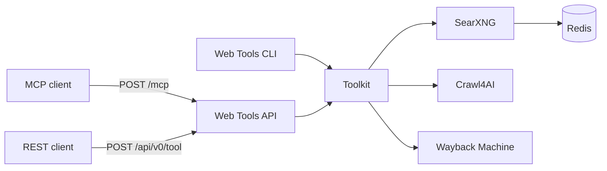
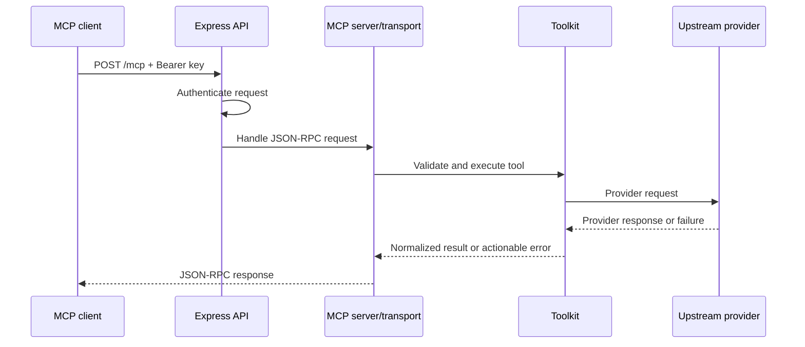
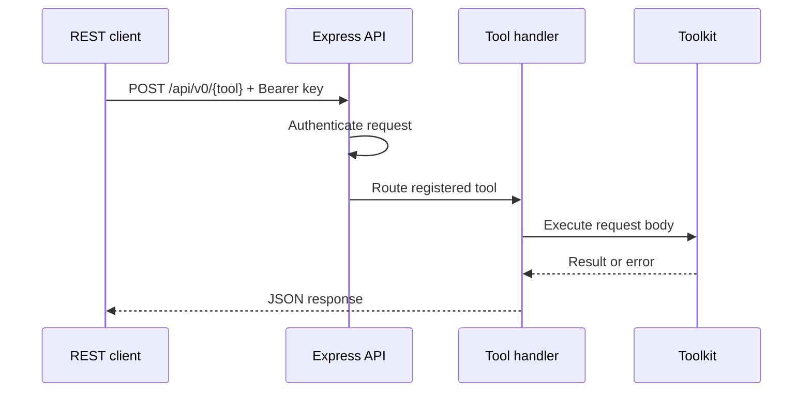
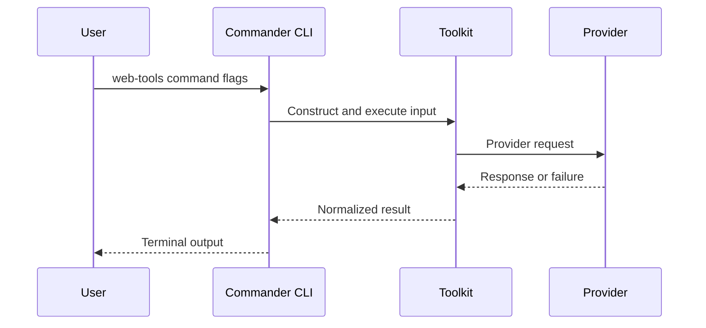

# Web Tools Architecture

## Overview

Web Tools is a pnpm TypeScript monorepo backed by three external runtime dependencies. Its core design rule is that tool behavior belongs to the framework-agnostic toolkit, while MCP, REST, and CLI are adapters over that behavior.

The deployed stack has four owned services: Web Tools, Crawl4AI, SearXNG, and Redis. Wayback Machine is an external upstream, not an owned deployment service.

## Package Boundaries

### `packages/toolkit`

The toolkit owns the public tool model and all provider-facing behavior:

- Zod input schemas
- Tool names, descriptions, and MCP annotations
- The `toolsByName` registry
- Tool implementation functions
- SearXNG, Crawl4AI, and Wayback clients
- Normalized output types
- Process-local call, bandwidth, and estimated-cost counters
- Environment-derived provider configuration

No toolkit function depends on Express or Commander. Provider protocol changes should be absorbed here without requiring transport-specific fixes.

### `packages/api`

The API package adapts HTTP requests to toolkit calls:

- Express application and JSON parsing
- API-key middleware
- Stateless Streamable HTTP MCP handling at `POST /mcp`
- REST discovery at `GET /api/v0`
- REST execution at `POST /api/v0/{tool_name}`
- Unauthenticated liveness response at `GET /health`
- Authenticated process-local statistics at `GET /stats`
- Transport-level status and error serialization

MCP and REST route through the same toolkit function map. The API package must not add separate provider behavior.

### `packages/cli`

The CLI package maps Commander commands and flags to toolkit inputs. It executes the toolkit in-process and does not call the REST API. This keeps local use independent of the API transport while preserving the same schemas and implementations.

## Runtime Services

### Web Tools

The Node.js 22 application hosts MCP and REST. It is stateless except for process-local usage counters. A restart creates a new statistics epoch identified by `started_at`.

### Crawl4AI

Crawl4AI owns browser-grade retrieval, rendering, extraction, screenshots, PDF generation, and JavaScript execution. Its protocol and result classification are encapsulated by the toolkit client.

### SearXNG

SearXNG owns metasearch aggregation. Web Tools normalizes useful search fields and distinguishes valid no-result responses from upstream failure; the mechanism is documented under [Search Failure Classification](#search-failure-classification).

### Redis

Redis supports the SearXNG service. Web Tools does not expose Redis as a public dependency or tool.

### Wayback Machine

The toolkit calls external CDX and archive endpoints for snapshot discovery and archived content. Upstream availability and rate limits are outside the owned service boundary.

## Authoritative Contracts

`packages/toolkit/src/tools.ts` is the authoritative registry of tool names, descriptions, intended input schemas, and MCP annotations. `packages/toolkit/src/functions.ts` maps registered names to implementations. MCP registers the Zod schema shapes with the SDK; REST and CLI currently pass inputs directly to toolkit functions without parsing those schemas. Closing that validation gap is part of Phase 2 in [`PRODUCT.md`](./PRODUCT.md).

When changing a tool:

1. Change or add its Zod schema.
2. Change the toolkit implementation and normalized result type.
3. Update the registry definition and function map.
4. Adapt CLI flags if the tool is available there.
5. Verify MCP and REST expose the same contract.
6. Update user-facing and durable feature documentation.

New transport work must not broaden the registry contract. Existing REST and CLI validation behavior is known debt, not a second authoritative contract.

## Request Flows

### MCP

The API creates a stateless MCP server and transport per request, then closes both when the response closes.

### REST

REST routes are generated from the toolkit registry, reducing the chance that a registered tool exists in one HTTP interface but not the other.

REST currently does not parse request bodies with the registered Zod schemas before execution. Toolkit functions perform uneven defensive checks, so invalid-input behavior can differ from MCP until Phase 2 validation work is complete.

### CLI

## Authentication And Trust

The API reads a bearer token from `Authorization` or an `api_key` query parameter and compares it with the configured key using fixed-length SHA-256 digests and `timingSafeEqual`. `/health` bypasses authentication. MCP, REST discovery, REST tool execution, and `/stats` require authentication.

The API key protects access to the service; it does not make arbitrary target URLs trustworthy. URLs, scripts, crawler configuration, and upstream responses remain untrusted input and must be validated or constrained at their boundary.

Do not log API keys, full secrets, or sensitive target content. Preserve upstream status and diagnostic context only when safe to return.

## Failure Model

Failures can originate in five layers:

- Input validation
- HTTP or MCP transport
- Toolkit orchestration
- Owned provider services
- External websites or Wayback Machine

Each layer should preserve enough context for the caller to distinguish failure from a legitimate empty result. The toolkit should normalize provider errors, while transports should preserve appropriate protocol status instead of returning successful empty payloads.

Retries must be bounded and limited to operations known to be safe. Cancellation and timeout signals should propagate through the toolkit to provider clients where supported.

### Search Failure Classification

The SearXNG client is the implemented reference for [`PRODUCT.md`](./PRODUCT.md) principle 2. `web_search` issues `Config.parallelRequests` parallel attempts, and each attempt resolves to one of three outcomes rather than to a nullable result:

- `ok` — HTTP 2xx, well-formed JSON, at least one result carrying both a title and a URL. Also records whether any result has content.
- `empty` — HTTP 2xx, well-formed JSON, zero usable results, and no total engine failure reported. This is a legitimate no-match.
- `failed` — the attempt did not produce a trustworthy answer. Carries a structured `reason` whose `cause` is one of `http_status` (with the upstream status code), `invalid_response` (unparseable body or unexpected JSON shape), `timeout` (an `AbortSignal.timeout` abort, classified on the `TimeoutError` name rather than message text), `network_error`, or `all_engines_unresponsive`.

Aggregation preserves the pre-existing selection behavior — the first content-bearing `ok` attempt wins and short-circuits, otherwise the first `ok` attempt with any results is used, then dedup-by-URL and `limit` truncation apply. When no attempt is `ok`:

- at least one `empty` attempt means the query genuinely matched nothing, so the tool succeeds with an empty array;
- every attempt `failed` means the search provider is unavailable, so the toolkit throws `SearchProviderError` (exported from the toolkit entry point) carrying an actionable message that names the failed operation and summarizes the distinct causes with counts, plus the per-attempt safe reasons on a structured `reasons` property.

An unexpected promise rejection inside the parallel race maps to a `failed` outcome, never to a non-failure, so a throw can never be counted as an empty success.

#### Engine-level outage detection

SearXNG's JSON response exposes `unresponsive_engines` but carries no field enumerating the full engine roster that ran. Classification therefore differs by request shape:

- an explicit engine list was requested — the attempt is `failed` only when **every** requested engine appears in `unresponsive_engines`; a partial engine failure with zero results stays `empty`;
- no explicit engine list was requested — **any** non-empty `unresponsive_engines` alongside zero results is `failed`.

The second rule is a deliberate trade-off. `SEARXNG_ENGINES` is blank in the default deployment and the `engines` argument is optional, so the "every requested engine" rule would be unreachable in exactly the configuration where outages occur. Zero results means no engine produced positive evidence the search worked, while a non-empty `unresponsive_engines` is concrete evidence something broke, and principle 2 makes a failure disguised as an empty success the more damaging error. The accepted cost is that an ambiguous no-match with one unresponsive engine is reported as a failure. `unresponsive_engines` is parsed defensively; a missing or malformed field is treated as "not reported" and never turns a genuine `empty` into a `failed`.

#### Reporting and observability

Each attempt emits exactly one single-line JSON record to stderr under the stable event name `searxng_attempt_outcome`, carrying the attempt number, the classification, and either the safe failure reason or result counts. Neither logs nor error messages contain API keys, secrets, or raw upstream response bodies.

A total search failure is recorded in the process-local counters as an errored call, so outages stay visible at `GET /stats` and through `web_usage_stats` instead of being indistinguishable from successful zero-result searches.

Transports surface the thrown error without adding search-specific behavior: MCP returns `isError: true` with the message in its `error` payload, REST returns HTTP 500 with an `error` field, and the CLI prints the error and exits non-zero rather than printing `No results found.`. The success-path shape of `web_search` is unchanged.

## Health And Statistics

`GET /health` currently proves that the API process can answer an HTTP request. It does not prove that Crawl4AI, SearXNG, Redis, target websites, or Wayback Machine are healthy.

`GET /stats` and `web_usage_stats` expose the same process-local counters. They reset on restart and are suitable for lightweight inspection, not durable accounting, billing, or historical monitoring.

## Testing

Tests run on the Node.js 22 built-in `node:test` runner with `node:assert/strict`. No test framework, runner, or assertion library is a dependency; the toolchain remains `typescript` plus `prettier`.

- Tests are TypeScript, written alongside the source they cover as `*.test.ts`.
- Each package carries a `tsconfig.test.json` that compiles source and tests into `dist-test/`, and a `tsconfig.build.json` that excludes `*.test.ts` so test code never reaches the shipped `dist/` or the production image. The root `Dockerfile` copies the build tsconfigs for that reason.
- Each package's `test` script compiles with `tsconfig.test.json` and then runs `node --test` over the compiled output; the root `test` script delegates to the packages.
- Provider behavior is simulated by stubbing `globalThis.fetch` and restoring it in teardown. Production code carries no dependency-injection seam that exists only for tests.
- Transport scenarios exercise the real MCP registration, the REST tool handler, and the CLI command registration in-process rather than by spawning a server or a subprocess.

Run all tests from the repository root with `pnpm test`; see [`../AGENTS.md`](../AGENTS.md) for the full validation command set.

## Deployment Model

Local orchestration uses Docker Compose. Production deployment material targets the same four-service topology. Configuration is supplied through environment variables and service URLs; secrets remain outside version control.

The service graph should remain explicit:

- Web Tools depends on reachable Crawl4AI and SearXNG endpoints.
- SearXNG depends on Redis according to its service configuration.
- Archive operations depend on public Wayback Machine endpoints.
- The API listens on the platform-provided `PORT`, defaulting to `3000` locally.

## Technology Choices

- **Node.js 22 and TypeScript**: one language and type system across toolkit and adapters.
- **pnpm workspaces**: explicit local package boundaries and deterministic monorepo builds.
- **Zod**: runtime validation aligned with inferred TypeScript types.
- **Express 5**: small HTTP adaptation layer for MCP, REST, health, and statistics.
- **Model Context Protocol SDK**: protocol implementation rather than a custom MCP transport.
- **Commander**: direct command-to-tool mapping for local use.
- **SearXNG, Crawl4AI, Redis, Wayback Machine**: focused upstreams rather than implementing search, browser automation, or archival storage in this repository.

## Change Constraints

- Preserve explicit `.js` suffixes in TypeScript ESM imports.
- Build toolkit before packages that consume it.
- Do not introduce transport-specific tool behavior.
- Do not expose raw provider responses unless the public contract deliberately requires them.
- Do not add durable state to process-local statistics by implication; that requires a separate product and architecture decision.
- Add a new runtime service only when its ownership and operating cost cannot fit an existing boundary.
